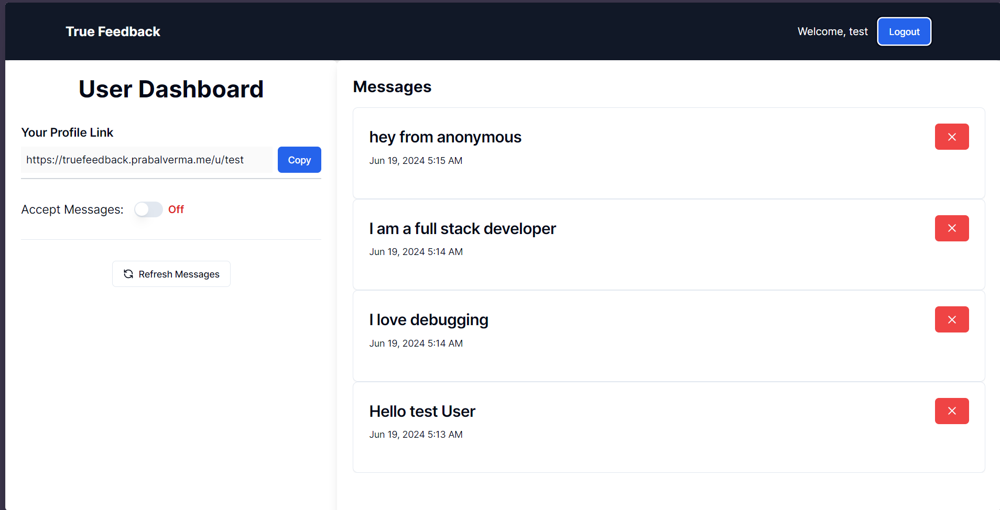
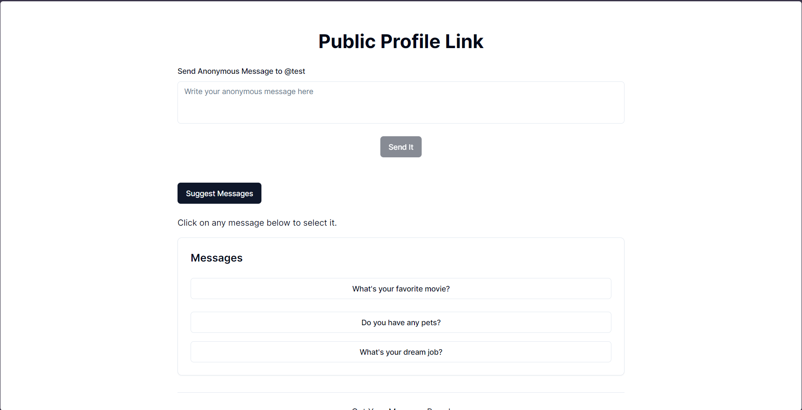

# TrueFeedback

TrueFeedback is a Next.js application built with TypeScript that allows users to send and receive anonymous messages. It also leverages the OpenAI ChatGPT API to generate random questions or prompts to encourage interaction. The application features two main interfaces: one for viewing received messages and another for sending anonymous messages. Authentication is implemented using NextAuth.

## UI DEMO
### HOME PAGE

### DASHBOARD PAGE

### PUBLIC PAGE


## Table of Contents

- [Features](#features)
- [Tech Stack](#tech-stack)
- [Getting Started](#getting-started)
  - [Prerequisites](#prerequisites)
  - [Installation](#installation)
  - [Running the Application](#running-the-application)
- [Configuration](#configuration)
- [Project Structure](#project-structure)
- [API Endpoints](#api-endpoints)
- [Contributing](#contributing)
- [License](#license)

## Features

- **Anonymous Messaging**: Users can send and receive anonymous messages.
- **ChatGPT Integration**: Generates random prompts or questions using the OpenAI API.
- **Authentication**: Secure user authentication with NextAuth.
- **User Interfaces**: Separate interfaces for sending and receiving messages.
- **Responsive Design**: Optimized for both desktop and mobile devices.

## Tech Stack

- **Frontend**: Next.js, TypeScript
- **Authentication**: NextAuth.js
- **API**: OpenAI ChatGPT API
- **Styling**: CSS Modules / Styled Components / Tailwind CSS (choose your preferred method)
- **Database**: (e.g., MongoDB, PostgreSQL - specify based on your setup)

## Getting Started

### Prerequisites

Before you begin, ensure you have the following installed:

- Node.js (>= 14.x)
- npm or yarn
- A MongoDB or PostgreSQL database instance (if using a database)
- An OpenAI API key

### Installation

1. Clone the repository:

   ```bash
   git clone https://github.com/prabal-verma/truefeedback.git
   cd truefeedback
2. Install dependencies:

```bash
npm install
# or
yarn install
```
3. ## Running the Application

Create a `.env.local` file in the root directory and add the following environment variables:

```env
NEXTAUTH_URL=http://localhost:3000
NEXTAUTH_SECRET=your_nextauth_secret
OPENAI_API_KEY=your_openai_api_key
DATABASE_URL=your_database_url
```

4. ## Running the Development Server

Run the development server:

```bash
npm run dev
# or
yarn dev

  ```

## Configuration

- **NextAuth**: Configure providers, callbacks, and other options in `pages/api/auth/[...nextauth].ts`.
- **OpenAI API**: Use the OpenAI API key in your server-side logic to generate random messages.

## Project Structure
```
truefeedback/
├── components/
│ ├── MessageList.tsx
│ ├── SendMessageForm.tsx
│ └── ...
├── pages/
│ ├── api/
│ │ ├── auth/
│ │ │ └── [...nextauth].ts
│ │ ├── messages.ts
│ │ └── ...
│ ├── index.tsx
│ ├── send.tsx
│ └── ...
├── public/
│ └── ...
├── styles/
│ ├── globals.css
│ └── ...
├── utils/
│ ├── openai.ts
│ └── ...
├── .env.local
├── next.config.js
├── package.json
└── README.md
```

## API Endpoints

- **GET /api/messages**: Fetch received messages for the authenticated user.
- **POST /api/messages**: Send a new anonymous message.
- **GET /api/generate-prompt**: Generate a random prompt using ChatGPT.

## Contributing

We welcome contributions! Please follow these steps to contribute:

1. Fork the repository.
2. Create a new branch for your feature or bugfix.
3. Commit your changes with clear messages.
4. Push your changes to your fork.
5. Create a pull request to the main branch of the original repository.

## License

This project is licensed under the MIT License. See the LICENSE file for details.


